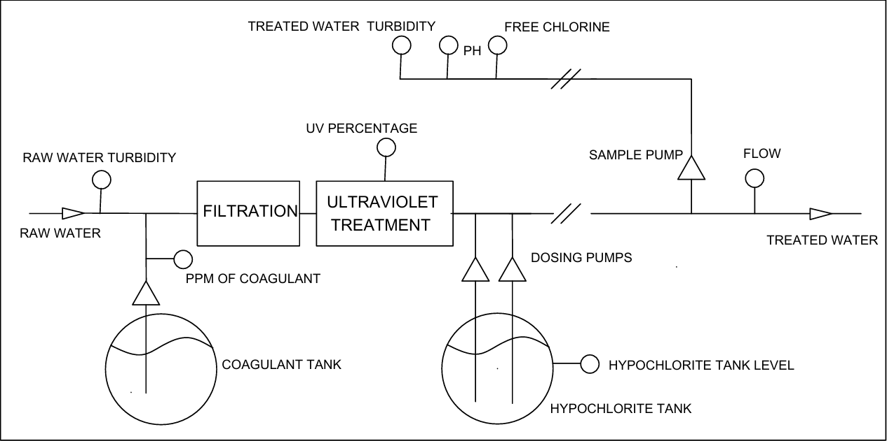
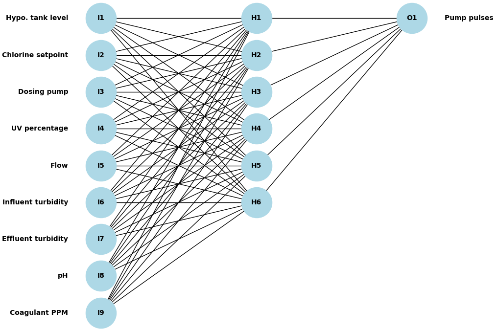
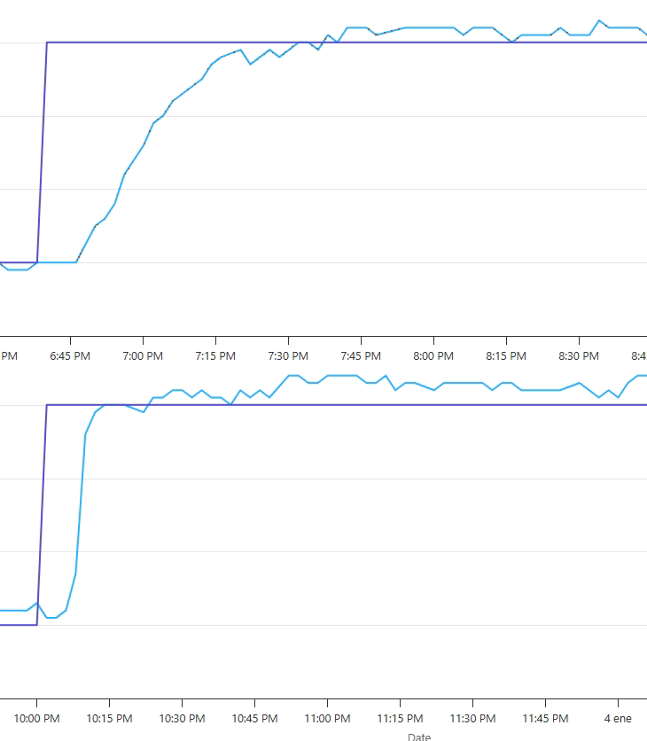

<!-- This is the markdown template for the final project of the Building AI course, 
created by Reaktor Innovations and University of Helsinki. 
Copy the template, paste it to your GitHub README and edit! -->

# Implementing a Neural Network on an S1500-PLC. Intelligent Chlorination.
Final project for the Building AI course

## Summary
This project focuses on predicting the pulse rate of a chlorine dosing pump in a drinking water treatment plant based on water characteristics. An AI model will be developed to calculate the required pulse frequency.

The model will be deployed on a Siemens S1500 PLC.

## Background
In water treatment plants, maintaining free chlorine levels is commonly managed using a classic PID (Proportional-Integral-Derivative) controller. However, the process requires a specific contact time between chlorine dosing and the measurement of free chlorine to ensure proper disinfection. This introduces a delay in the control loop, which can result in challenges such as instability, oscillations, or overshooting, potentially compromising water quality and dosing efficiency.

This project aims to implement an artificial intelligence based solution to predict the pulse frequency of sodium hypochlorite dosing pumps. While the PID controller will remain part of the closed loop, its role will shift to compensatory adjustments, focusing on fine-tuning the free chlorine level. By relying on predictive AI, the system will reduce fluctuations and enhance the stability of the dosing process.

Although linear regression could be used for this task, a small neural network is better suited to capture the breakpoint in chlorination and address non-linear behaviors effectively.

## The Treatment Plant

The treatment process begins with the dosing of coagulant, followed by filtration of the water. After that, the water undergoes ultraviolet (UV) treatment, and finally, it is chlorinated.

We monitor several parameters throughout the process, including:

- Turbidity of raw water
- PPM of coagulant
- UV percentage
- Which dosing pump is operating
- Hypochlorite tank level
- pH levels
- Free chlorine
- Chlorine setpoint
- Turbidity of treated water
- Flow rate
- Free chlorine treated water

## Data sources
We have an extensive dataset, with measurements recorded every 2 minutes over several years, including the parameters mentioned earlier. However, careful filtering is required to select only the data that can effectively train the neural network.

## Data Filtering
1. Initial Data Filtering:
At first, I filtered the data by discarding entries where the difference between the setpoint (desired free chlorine) and the measurement (measured free chlorine) was greater than 1% of the setpoint value. I then trained the neural network with the remaining data (as I will explain later). However, the data wasn't good enough, which led to convergence problems during training.

2. Alternative Data Filtering Approach:
To address these problems, I tried a different filtering method. Instead of discarding only the data where the difference between the setpoint and the measured value was greater than 1%, I also removed all entries where such differences occurred in the 5 readings before and after the current entry. This approach aimed to retain only the data that more accurately captured the relationship between water parameters and the pulse rate of the pumps.

## Data Format Description
The dataset is stored in a .csv file with a total of 8,463 rows, including the header row. The structure of the file is as follows:

| Pulses | TankLvl | ClSet | Pump | UV%   | Flow  | InfTurb | EffTurb | pH   | CoagPPM |
|--------|---------|-------|------|-------|-------|---------|---------|------|---------|
| 53.55  | 64.87   | 0.7   | 1    | 31.37 | 88.28 | 1.81    | 0.88    | 9.21 | 0       |
| 58.16  | 78.75   | 0.7   | 1    | 25.93 | 96.72 | 0.61    | 0.32    | 8.8  | 0       |
| 44.44  | 64.19   | 0.7   | 2    | 35.08 | 97.81 | 1.06    | 0.57    | 9.06 | 0       |
| 56.36  | 69.62   | 0.7   | 1    | 32.24 | 90.47 | 0.69    | 0.39    | 8.79 | 0       |
| ...    | ...     | ...   | ...  | ...   | ...   | ...     | ...     | ...  | ...     |

- **The first column** (Output) represents the pump pulses This is the target variable the network is trained to predict.
- **The next 9 columns** correspond to the input features:
  - **1:** Hypo. tank level
  - **2:** Chlorine setpoint
  - **3:** Dosing pump
  - **4:** UV percentage
  - **5:** Flow
  - **6:** Influent turbidity
  - **7:** Effluent turbidity
  - **8:** pH
  - **9:** Coagulant PPM
 
The dataset file is located in the **data** folder under the name **water_treatment_data.csv**.

## Neural Network Structure
The chosen neural network architecture will be simple to facilitate easy implementation on a Siemens S1500 PLC. I will experiment with a hidden layer with 6 neurons using a ReLU activation function, which is straightforward to implement. The output layer will consist of a single neuron without an activation function, allowing for continuous output across the full range.

## Supervised Training of the Model
The model training process will be carried out using Python, leveraging its powerful libraries such as TensorFlow or Keras for building and training the neural network. During this process, I have used the assistance of an AI tool (ChatGPT) to guide me through the coding.

The program must perform the following tasks:

**1. Data Preparation**
   - Reads data from a CSV file, separates input features (9 columns) and the target variable (1 column).
   - Converts data to numeric and standardizes features using StandardScaler to improve model performance.
   
**2. Model Creation**
   - Defines a simple neural network with:
     - A hidden layer (6 neurons, ReLU activation).
     - A dropout layer that randomly disables 20% of the neurons in the hidden layer to prevent overfitting.
     - A output neuron (linear activation for regression).
   - Uses adam optimizer, mean squared error (MSE) as the loss function, and mean absolute error (MAE) as a metric.

**3. Training**
   - Splits data into training (80%) and validation (20%) sets using scikit-learn's train_test_split.
   - Trains the model with TensorFlow/Keras, applying backpropagation and Early Stopping to avoid overfitting.
   - Tested multiple configurations and techniques to optimize performance, including:
     - Dropout layers.
     - K-fold Cross-Validation
     - Different dataset splits.
     - Tuning the number of epochs and batch size.
    
**4. Evaluation**
    - Assesses the model on the validation set using MSE, MAE, and R2.

**5. Visualization**
   - Creates graphs to evaluate performance, including loss curves, scatter plots of predictions vs. actual values, residual distributions, and line plots.

**6. Exporting Results**
   - Extracts weights, biases, and scaling parameters (mean and standard deviation) from the model and displays them in a format that can be directly copied and pasted into a TIA Portal Data Block.

The program is available in the **src** folder under the name **train_neural_network.py**.

## Implementing the Neural Network in a Siemens S7-1500 PLC
- **Initialization:** At the beginning of the program, within the FishScan system, it is essential to load the weights, biases, and normalization data into their respective Instance Data Blocks (DBs). These blocks will hold the trained weights and biases of the neural network, as well as the normalization parameters (mean and standard deviation) used during training.
   - [Neural Network Initialization](https://github.com/lmpipaon/Smart-Chlorination/blob/main/PLC/NEURAL_NETWORK_INITIALIZATION.pdf)
   - [Neural Network weights, biases and normalization data](https://github.com/lmpipaon/Smart-Chlorination/blob/main/PLC/NEURAL_NETWORK_WEIGHTS_BIASES_NORMALIZATION.pdf) 
(The training process of the neural network has been implemented in such a way that the results can be directly copied and pasted into a database in TIA Portal, facilitating its use in automation systems.)

- **Normalization:** Before feeding the data into the network, the input features must be normalized to ensure that the scale of the input values does not interfere with the learning process
  - [Normalization](https://github.com/lmpipaon/Smart-Chlorination/blob/main/PLC/NORMALIZATION.pdf)

- **Hidden Layer Neurons:** These neurons have 9 input connections, and they use the ReLU (Rectified Linear Unit) activation function to introduce non-linearity into the network, allowing it to learn complex patterns in the data.
  -  [Hidden Neuron](https://github.com/lmpipaon/Smart-Chlorination/blob/main/PLC/HIDDEN_NEURON.pdf)

- **Output Layer Neurons:** These neurons have 6 input connections and do not use an activation function, as the output is a linear result based on the weighted sum of inputs.
  - [Output Neuron](https://github.com/lmpipaon/Smart-Chlorination/blob/main/PLC/OUTPUT_NEURON.pdf)

- **Neural Network:** Finally, a function will be responsible for executing the following steps: Normalize the 9 Input Features, Calculate the Hidden Layer Neurons, Calculate the Output Neuron.
  - [Neural Network](https://github.com/lmpipaon/Smart-Chlorination/blob/main/PLC/NEURAL_NETWORK.pdf)

This function will be called every second from the main program

 
## Integration with the Existing PID Controller
To ensure a smooth transition and maintain stability in the chlorine dosing process, the existing PID controller remains part of the control loop, operating alongside the neural network. The outputs of both systems are combined to calculate the final pulse rate for the dosing pump:

**Combining Outputs:**
The output of the neural network is added to the output of the PID controller. The neural network predicts the required pulse frequency based on water parameters, providing a rapid adjustment to the dosing process. The PID controller fine-tunes the free chlorine level by compensating for any residual errors.

**Delay Compensation:**
In the chlorine dosing system, there is an inherent delay of approximately 9 minutes between the time chlorine is dosed and when its effect is measured at the free chlorine sensor.

To prevent the PID controller from attempting to compensate for differences that do not yet exist (as the neural network adjusts instantly to the new setpoint), a delay of 9 minutes is introduced at the setpoint input to the PID controller.
This ensures that the PID controller reacts only to actual deviations in the free chlorine level, avoiding unnecessary oscillations and maintaining system stability.
By combining the predictive capabilities of the neural network with the PID controller's fine-tuning adjustments and introducing delay compensation, the system achieves a more stable and efficient chlorine dosing process.

## Testing and Comparing Regulation with and without the Neural Network
Once the neural network was implemented to regulate the pulse rate of the dosing pumps, its performance was satisfactory, adapting well to the system. This reduced the reliance on the PID controller, which played a minimal role in the regulation process. After observing its operation over a prolonged period, I verified that the error consistently remained within a 2% range, matching the results predicted by the model.

The following graph illustrates the response to a step change from 0.7 to 1.0 ppm of free chlorine in the setpoint. The upper graph shows the response using only the PID controller, where the adjustment is slow and gradual toward the target. In contrast, the lower graph demonstrates the response when the neural network is combined with the PID controller in regulation, where the only delay present is the contact time allowed between dosing and measurement to let the chlorine reaction take effect.

## Future Steps
**Improve the Neural Network:** Investigate relationships between input features, as some variables may depend on others to a certain degree. Removing redundant or less relevant inputs could improve performance.

**Experiment with Different Neural Network Topologies:** Test deeper architectures with additional hidden layers to explore whether they better capture the complexities of the data.

**Collect More and Better-Quality Data:** Expand the dataset to include more samples, ensuring higher quality to improve the neural network.

**Incorporate Self-Learning Capabilities:** Explore self-learning where the system can update its model based on newly collected data in real time.

## Neural Network Output Simulator for Chlorine Dosing
I made this interactive [web tool](https://lmpipaon.github.io/web/playing_NN.html) for fun! You can enter water parameters and see how the neural network calculates the pump pulses. Try it and see how it works!
(Updated with an improved neural network model, more accurate calculations, and an online neural network visualizer.
- [web tool](https://lmpipaon.github.io/web/NN_online.html)  
- [web tool](https://lmpipaon.github.io/web/NN_online.html)  
)

## Sources
### Artificial Intelligence Tools:
- [ChatGPT](https://chat.openai.com)
- [GitHub Copilot](https://copilot.github.com)

### Online Tutorials and Videos:
- [RingaTech YouTube Channel](https://www.youtube.com/@RingaTech)
- [DotCSV YouTube Channel](https://www.youtube.com/@DotCSV)
- ["Understanding Neural Networks" by DotCSV](https://www.youtube.com/watch?v=Icj2ey6TxEI)

### Platforms and Resources:
- [Google Colab](https://colab.research.google.com)

## Acknowledgment
I am grateful for the resources and tools that supported me throughout this project. As English is not my native language, I did my best to write clearly but relied on AI tools like ChatGPT and GitHub Copilot, as well as educational content from YouTube channels such as RingaTech and DotCSV, to refine and improve my work. Their guidance and insights were invaluable.
