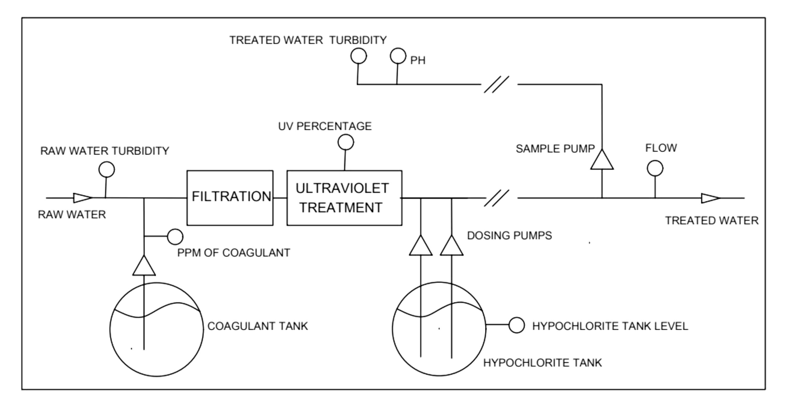

<!-- This is the markdown template for the final project of the Building AI course, 
created by Reaktor Innovations and University of Helsinki. 
Copy the template, paste it to your GitHub README and edit! -->

# Smart-Chlorination
Final project for the Building AI course

## Summary

This project focuses on predicting the pulse rate of a chlorine dosing pump in a drinking water treatment plant based on water characteristics. An AI model will be developed to calculate the required pulse frequency.

The model will be deployed on a Siemens S1500 PLC to facilitate real-time data processing and automated pump control.

## Background

In water treatment plants, maintaining free chlorine levels is commonly managed using a classic PID (Proportional-Integral-Derivative) controller. However, the process requires a specific contact time between chlorine dosing and the measurement of free chlorine to ensure proper disinfection. This introduces a delay in the control loop, which can result in challenges such as instability, oscillations, or overshooting, potentially compromising water quality and dosing efficiency.

This project aims to implement an artificial intelligence based solution to predict the pulse frequency of sodium hypochlorite dosing pumps. While the PID controller will remain part of the closed loop, its role will shift to compensatory adjustments, focusing on fine-tuning the free chlorine level. By relying on predictive AI, the system will reduce fluctuations and enhance the stability of the dosing process.

Although linear regression could be used for this task, a small neural network is better suited to capture the breakpoint in chlorination and address non-linear behaviors effectively.

## The Treatment Plant

The treatment process begins with the dosing of coagulant, followed by filtration of the water. After that, the water undergoes ultraviolet (UV) treatment, and finally, it is chlorinated.

We monitor several parameters throughout the process, including:

- Turbidity of raw water
- PPM of coagulant
- UV percentage
- Which dosing pump is operating
- Hypochlorite tank level
- pH levels
- Free chlorine
- Chlorine setpoint
- Turbidity of treated water
- Flow rate
- Free chlorine treated water

## Input Features
## Data sources
We have an extensive dataset, with measurements recorded every 2 minutes over several years, including the parameters mentioned earlier. However, careful filtering is required to select only the data that can effectively train the neural network.

###Data Filtering
At first, I filtered the data by discarding entries where the difference between the setpoint (desired free chlorine) and the measurement (measured free chlorine) was greater than 1% of the setpoint value. I then trained the neural network with the remaining data (as I will explain later). However, the data wasn't good enough, which led to convergence problems during training, such as unstable learning, overfitting, or poor generalization. These are common issues when the data isn't precise, consistent, or relevant enough.

## Challenges

What does your project _not_ solve? Which limitations and ethical considerations should be taken into account when deploying a solution like this?

## What next?

How could your project grow and become something even more? What kind of skills, what kind of assistance would you  need to move on? 

## Acknowledgments

* list here the sources of inspiration 
* do not use code, images, data etc. from others without permission
* when you have permission to use other people's materials, always mention the original creator and the open source / Creative Commons licence they've used
   For example: [Sleeping Cat on Her Back by Umberto Salvagnin](https://commons.wikimedia.org/wiki/File:Sleeping_cat_on_her_back.jpg#filelinks) / [CC BY 2.0](https://creativecommons.org/licenses/by/2.0)
* etc
